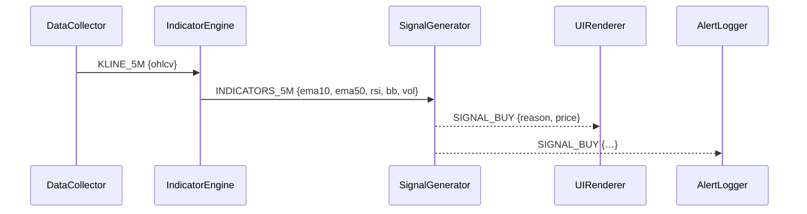

# AGENTS.md

**Windsurf — Bitcoin & SPX 5-Minute Trading Dashboard**

> A lightweight, free-API, TypeScript/Next.js system that emits high-quality BUY/SELL signals.  
> Agents listed below must **coordinate asynchronously** via typed JSON messages (see schema).

---

## 0. Global Constraints

| Key            | Value                                             |
| -------------- | ------------------------------------------------- |
| Language       | TypeScript 5 (strict)                             |
| Max REST calls | ≤ 5 req / min / endpoint                          |
| Cache TTL      | 15 s (REST)                                       |
| WebSockets     | Single stream per asset                           |
| Secrets        | `.env.local` only                                 |
| Style          | Prettier + ESLint, 2-space indent, 100-char lines |
| Data window    | 90 days backfill (for backtests)                  |
| Target asset   | BTC-USDT (Binance)                                |
| Benchmarks     | SPY, ^GSPC (Yahoo)                                |

---

## 1. Free Data Sources

| Source        | URL / Channel                                       | Notes                |
| ------------- | --------------------------------------------------- | -------------------- |
| Binance WS    | `wss://stream.binance.com:9443/ws/btcusdt@kline_5m` | Live OHLCV 5 m       |
| CoinGecko     | `/coins/bitcoin/market_chart`                       | REST backfill        |
| Yahoo Finance | `yfinance` / RapidAPI                               | SPY, ^GSPC, VIX, DXY |
| alt.me F&G    | `https://api.alternative.me/fng/`                   | Sentiment            |
| FRED          | `https://fred.stlouisfed.org/`                      | 10-Y yield           |

---

## 2. Project Layout

```
/app          – Next.js routing & pages
/components   – React widgets
/lib
  ├─ agents   – Individual agent classes
  ├─ data     – Fetchers / cache
  ├─ indicators.ts
  ├─ signals.ts
/config       – tweakable JSON (thresholds)
/types        – global TypeScript defs
/scripts      – backtest, lint, test
```

---

## 3. Message Contract (`/types/agent.ts`)

```ts
export interface AgentMessage<T = any> {
  from: AgentRole;
  to: AgentRole | 'broadcast';
  type: string;        // e.g., "KLINE_5M", "SIGNAL_BUY"
  payload: T;
  ts: number;          // ms since epoch
}

export type AgentRole =
  | 'Orchestrator'
  | 'DataCollector'
  | 'IndicatorEngine'
  | 'SignalGenerator'
  | 'UIRenderer'
  | 'AlertLogger'
  | 'Backtester'
  | 'QATester';
```

---

## 4. Agent Directory

| Role                | Responsibilities                                                | Consumes                    | Emits             |
| ------------------- | --------------------------------------------------------------- | --------------------------- | ----------------- |
| **Orchestrator**    | Boot agents, route messages, recover on errors                  | –                           | broadcast         |
| **DataCollector**   | Connect to Binance WS & REST backfills; throttle & cache; normalize OHLCV | none                        | `KLINE_5M`        |
| **IndicatorEngine** | Compute EMA-10/50, RSI-14, BB-20-2, Volume SMA-20               | `KLINE_5M`                  | `INDICATORS_5M`   |
| **SignalGenerator** | Apply rule set (EMA crosses, RSI extremes, BB touches, volume confirmation) | `INDICATORS_5M`             | `SIGNAL_BUY/SELL` |
| **UIRenderer**      | Update React context, render SignalCard & TradingView widget    | `INDICATORS_5M`, `SIGNAL_*` | n/a               |
| **AlertLogger**     | Toast UI alerts; persist signals to `localStorage`              | `SIGNAL_*`                  | n/a               |
| **Backtester**      | On demand: fetch 90-day data, replay rules, calc KPIs           | manual trigger              | report            |
| **QATester**        | Jest tests; validate indicators & signals; CI gate             | repo code                   | pass/fail         |

---

## 5. Signal Rules (5-Minute BTC)

1. **Trend Crossover**  
   *BUY*: EMA-10 crosses **above** EMA-50.  
   *SELL*: EMA-10 crosses **below** EMA-50.
2. **Momentum + Volatility Bounce**  
   *BUY*: Close ≤ lower BB *and* RSI < 30.  
   *SELL*: Close ≥ upper BB *and* RSI > 70.
3. **Volume Confirmation**  
   Trigger only if current volume ≥ 1.5 × SMA-20.
4. **Cooldown**  
   Ignore duplicate signals within 15 min.

Signal object:

```ts
export interface TradeSignal {
  asset: 'BTC';
  interval: '5m';
  type: 'BUY' | 'SELL';
  reason: string;
  price: number;
  ts: number;
}
```

---

## 6. Automated Task Execution

1. **AutoTaskRunner Agent**
   - Scans `TASKS.md` for unchecked items.
   - Launches the appropriate agents (DataCollector, IndicatorEngine, etc.) to implement each task.
   - Runs `npm run lint`, `npm run test`, and `npm run backtest` after applying changes.
   - Automatically commits to the repository using [Conventional Commits](see “Commit Guidelines” in `TASKS.md`).
2. **Commit Tracking**
   - Every commit references the corresponding task line(s) from `TASKS.md`.
   - Test results and logs are stored under `/logs` for later review.
3. **Feedback Loop**
   - When you pull the latest commits, review `/logs` for test output and backtest results.
   - Mark the completed tasks in `TASKS.md` and push the updated file; AutoTaskRunner will proceed with the next items.

---

## 7. How Agents Communicate (Example)



---

## 8. Local Commands

| Command            | Purpose            |
| ------------------ | ------------------ |
| `npm run dev`      | Next.js hot reload |
| `npm run test`     | Jest unit tests    |
| `npm run backtest` | CLI backtest       |
| `npm run lint`     | ESLint + Prettier  |

---

## 9. Editing Thresholds

`/config/signals.json`

```json
{
  "emaFast": 10,
  "emaSlow": 50,
  "rsiPeriod": 14,
  "rsiBuy": 30,
  "rsiSell": 70,
  "bbPeriod": 20,
  "bbStdDev": 2,
  "volumeMult": 1.5,
  "signalCooldownMin": 15
}
```

Change & hot-reload—no code edits required.

---

## 10. Done Definition

- A new BUY/SELL signal appears in `SignalCard` within 1–2 s of real-time candle close.
- Backtest KPIs are logged to `/logs/backtest-<timestamp>.txt`.
- All tasks in `TASKS.md` marked as complete have corresponding commits and passing tests.

### Removing PR Requirement
Since tasks are now executed and committed automatically, manual pull requests are no longer mandatory. You may still open a PR when you want a human review, but AutoTaskRunner can push directly to the main branch once tests pass.

---

> **Follow this AGENTS.md exactly.**  
> AutoTaskRunner handles commits automatically; review `/logs` for failures or backtest results.
